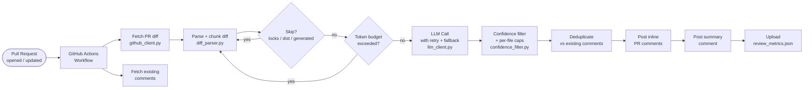

# LLM Code Reviewer

[](https://github.com/Omar-Sa03/llm-code-reviewer/actions/workflows/ci.yml)
[](https://github.com/Omar-Sa03/llm-code-reviewer/actions/workflows/eval.yml)


An automated code review tool that runs on every pull request. It reads the diff, sends each changed chunk to an LLM, and posts **inline comments** directly on the PR with issues it finds — security vulnerabilities, bugs, performance problems, and logic errors.

Designed to be dropped into any GitHub repository with a two-step setup. Supports HuggingFace, OpenAI, and Anthropic models.

---

## Architecture



---

## Quick start

### 1. Add secrets

In your repository: **Settings → Secrets and variables → Actions**

| Secret | Value |
|--------|-------|
| `HF_TOKEN` | Your [Hugging Face API token](https://huggingface.co/settings/tokens) (for HuggingFace provider) |

### 2. Add the workflow

Create `.github/workflows/review.yml`:

```yaml
name: LLM Code Review

on:
  pull_request:
    types: [opened, synchronize]
    paths-ignore:
      - "*.md"
      - "docs/**"

jobs:
  review:
    runs-on: ubuntu-latest
    permissions:
      pull-requests: write
      contents: read
    steps:
      - uses: actions/checkout@v4
        with:
          fetch-depth: 0
      - uses: Omar-Sa03/llm-code-reviewer@v1
        with:
          hf_token: ${{ secrets.HF_TOKEN }}
```

---

## Configuration

| Input | Default | Description |
|-------|---------|-------------|
| `hf_token` | — | HuggingFace API token (required for HF provider) |
| `model` | `Qwen/Qwen2.5-Coder-32B-Instruct` | Any chat model on the selected provider |
| `provider` | `huggingface` | `huggingface` · `openai` · `anthropic` |
| `max_comments` | `8` | Max inline comments per PR |
| `max_comments_per_file` | `3` | Max inline comments per file |
| `prompt_version` | `v2` | `v1` (original) · `v2` (chain-of-thought, higher precision) |
| `cost_limit_usd` | `0.10` | Estimated USD limit — chunks over budget are skipped |
| `max_diff_tokens` | `6000` | Max token estimate per chunk — oversized chunks are skipped |

### OpenAI example

```yaml
- uses: Omar-Sa03/llm-code-reviewer@v1
  with:
    model: gpt-4o-mini
    provider: openai
  env:
    OPENAI_API_KEY: ${{ secrets.OPENAI_API_KEY }}
```

---

## Comment types

Each issue is tagged with a **severity level** and a **category**.

**Severity**
- 🔴 `error` — likely failure, data loss, or security vulnerability
- 🟡 `warning` — could cause problems in certain conditions
- 🔵 `suggestion` — style, readability, or minor quality note

**Category**
- `security` — injection vulnerabilities, hardcoded secrets, insecure defaults
- `bug` — logic errors, off-by-one, unhandled edge cases
- `performance` — N+1 queries, unnecessary work in loops
- `logic` — control flow that doesn't match intent, unreachable code
- `style` — naming, formatting, readability

Issues below the confidence threshold for their severity level are discarded and never posted.

---

## Observability — review_metrics.json

Every run uploads a structured `review_metrics.json` artifact:

```json
{
  "run_id": "a1b2c3d4",
  "model": "Qwen/Qwen2.5-Coder-32B-Instruct",
  "prompt_version": "v2",
  "summary": {
    "files_reviewed": 4,
    "issues_raw_total": 12,
    "issues_kept_total": 5,
    "llm_errors_total": 0,
    "total_token_estimate": 2840,
    "estimated_cost_usd": 0.0,
    "total_duration_ms": 8412.3
  },
  "per_file": [...]
}
```

Queryable across runs via the [GitHub Artifacts API](https://docs.github.com/en/rest/actions/artifacts).

---

## Eval harness

The `evals/` directory contains 20 annotated diff fixtures (SQL injection, hardcoded secrets, N+1 queries, off-by-one errors, etc.) and a precision/recall runner for A/B prompt comparison.

```bash
export HF_TOKEN=your_token

# Run v1 prompt eval
python evals/run_eval.py --prompt-version v1 --output evals/results/v1_baseline.json

# Run v2 (chain-of-thought) eval
python evals/run_eval.py --prompt-version v2 --output evals/results/v2_baseline.json
```

A weekly GitHub Actions workflow runs this automatically for **model drift detection** — if precision drops below 70%, the job fails.

---

## Running locally

```bash
cp .env.example .env   # fill in your tokens
pip install -r requirements.txt
python -m reviewer.main
```

---

## Running tests

```bash
pip install -r requirements.txt
python -m pytest tests/ -v
```

The test suite covers the diff parser, confidence filter, prompt builder, JSON response parser, retry utility, deduplicator, cost estimator, metrics collector, and a full end-to-end pipeline run with all external HTTP calls mocked.

---

## Files that are skipped

The reviewer automatically ignores generated and vendored files:

- Lock files (`package-lock.json`, `yarn.lock`, `*.lock`)
- Compiled / minified output (`dist/`, `build/`, `*.min.js`, `*.min.css`)
- Database migrations
- Protobuf generated files (`*_pb2.py`)
- Snapshot files (`*.snap`)
- Any file matching `*.generated.*`

---

## Skills demonstrated

| Area | What this project demonstrates |
|------|-------------------------------|
| **LLM engineering** | Prompt versioning (v1 vs v2 chain-of-thought), structured JSON output, confidence calibration |
| **Eval methodology** | Precision/recall harness with 20 annotated fixtures, A/B prompt comparison, model drift detection |
| **Reliability engineering** | Retry with exponential backoff, provider fallback (HF → OpenAI), token budget guards, typed error handling |
| **Observability** | JSON-structured logging with run-level trace IDs, per-run metrics artifact, per-file latency tracking |
| **CI/CD** | GitHub Actions composite action, CI workflow (pytest + ruff + mypy), weekly eval cron with drift alerting |
| **API design** | Multi-provider abstraction (HuggingFace / OpenAI / Anthropic), idempotent deduplication |
| **Python engineering** | Typed dataclass config, connection pooling (requests.Session), modular test suite |

---

## What I'd do differently in production

- **Replace polling-based eval with an online eval pipeline** — log all LLM inputs/outputs to an append-only store, run the judge asynchronously, and surface quality trends in a dashboard rather than a weekly batch job.
- **Add a rate-limit token bucket** — the current retry handles 429s reactively; a proactive token bucket would prevent them.
- **Multi-modal diff context** — send surrounding file context (not just the diff hunk) as a separate system message to reduce false positives from decontextualised code.
- **Structured output mode** — use `response_format={"type": "json_schema"}` (supported by OpenAI and newer HF models) to guarantee valid JSON and eliminate the regex extraction hack.
